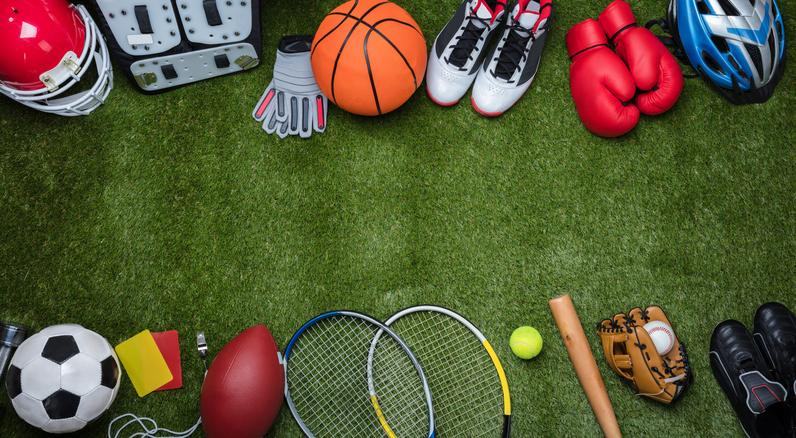

# OpenSportsLib


OpenSportsLib is a modular Python library for sports video understanding.

It provides a unified framework to **train, evaluate, and run inference** for key temporal understanding tasks in sports video, including:

- **Action classification**
- **Action localization / spotting**
- **Visual Question Answering (VQA)**
- **Action retrieval**
- **Action description / captioning**

OpenSportsLib is designed for **researchers, ML engineers, and sports analytics teams** who want reproducible and extensible workflows for sports video AI.

## Why OpenSportsLib?

- Unified workflow for training and inference
- Modular design for adding new tasks, datasets, and models
- Config driven experiments for reproducibility
- Optional SpoTTA test-time adaptation for E2ESpot inference
- Support for multiple modalities and sports workflows
- Research friendly while still usable in applied settings

## Quick links

- **Documentation:** https://opensportslab.github.io/opensportslib/
- **OSL JSON format:** https://opensportslab.github.io/opensportslib/data/osl-json-format/
- **PyPI:** https://pypi.org/project/opensportslib/
- **Issues:** https://github.com/OpenSportsLab/opensportslib/issues

---

## Installation

> Requires **Python 3.12+**.  
> Supports CUDA 12.6 / 12.8 / 13.0 (with CPU fallback).  
> PyTorch Geometric is supported up to PyTorch 2.10.*.

### Create conda env

```bash
conda create -n osl python=3.12 pip -y
conda activate osl
```

### Stable release

```bash
pip install opensportslib
```

### Pre release

```bash
pip install --pre opensportslib
```

### Source development version

```bash
pip install -e .
```

### Setup Environment (PyTorch, CUDA aware & Optional Dependencies)
```bash
# Install PyTorch (CPU/GPU auto-detected)
opensportslib setup

# Optional: install PyTorch Geometric support
opensportslib setup --pyg

# Optional: install for DALI support
opensportslib setup --dali

# Optional: install the X-VARS-compatible VQA dependency profile
opensportslib setup --vqa_xvars

# Optional: install the Qwen-compatible VQA dependency profile
opensportslib setup --vqa_qwen
```
---

**Note:**  
Run `opensportslib setup` to automatically configure dependencies.  
If issues occur, manually install compatible versions of `torch`, `torchvision`, and related libraries according to your CUDA version or system compatibility.

For VQA, use exactly one backend-specific dependency profile:

- `--vqa_xvars` installs the X-VARS-compatible Hugging Face stack from `XVARS_DEPENDENCY_PINS`
- `--vqa_qwen` installs the Qwen-compatible Hugging Face stack from `QWEN_DEPENDENCY_PINS`

The `vqa_qwen` config supports `Qwen/Qwen2.5-7B-Instruct` and `Qwen/Qwen3.5-9B-Base`.

---

## Data and pretrained models

OpenSportsLib uses external annotation files, datasets, and pretrained checkpoints.

Public assets are hosted under the **OpenSportsLab Hugging Face organization**:

**https://huggingface.co/OpenSportsLab**

Use it as the main entry point to find:
- datasets
- annotation files
- extracted features
- pretrained models and checkpoints

See the [Model Zoo](docs/model-zoo.md) for available pretrained models,
reported scores, datasets, and loading snippets.

---

## Dataset format

OpenSportsLib annotation files use the **OSL JSON v2.0** format. A dataset JSON
contains top-level metadata, a shared `labels` schema, and a `data` array where
each sample points to one or more inputs.

Minimal classification sample:

```json
{
  "labels": {
    "action": {
      "type": "single_label",
      "labels": ["pass", "shot"]
    }
  },
  "data": [
    {
      "id": "clip_0001",
      "inputs": [
        {
          "type": "video",
          "path": "clips/clip_0001.mp4",
          "fps": 25.0
        }
      ],
      "labels": {
        "action": {
          "label": "shot"
        }
      }
    }
  ]
}
```

Minimal localization sample:

```json
{
  "labels": {
    "action": {
      "type": "single_label",
      "labels": ["pass", "shot"]
    }
  },
  "data": [
    {
      "id": "game_0001",
      "inputs": [
        {
          "type": "video",
          "path": "games/game_0001.mp4",
          "fps": 25.0
        }
      ],
      "events": [
        {
          "head": "action",
          "label": "pass",
          "position_ms": 1240
        }
      ]
    }
  ]
}
```

Relative paths in `inputs[].path` are resolved from the split media root in the
YAML config, for example `DATA.common.splits.train.source_path`. Localization
records may also declare half-open physical-video ranges in
`metadata.intervals`; the OpenCV loader treats them as ordered logical videos
and evaluates only segments marked `verified`. See the full
[OSL JSON format guide](docs/data/osl-json-format.md) for field definitions,
multi-modal examples, prediction payloads, and conversion notes.

---

## Quickstart

### Import the library

```python
import opensportslib
print("OpenSportsLib imported successfully")
```

### Train a classification model

```python
from opensportslib.apis import ClassificationModel

my_model = ClassificationModel(
    config="/path/to/classification.yaml",
    weights=None,  # optional: path or Hugging Face model ID
)

my_model.train(
    train_set="/path/to/train_annotations.json",
    valid_set="/path/to/valid_annotations.json",
)
```

### Run inference

```python
from opensportslib.apis import ClassificationModel

my_model = ClassificationModel(
    config="/path/to/classification.yaml",
    weights=None,  # optional: path or Hugging Face model ID
)

predictions = my_model.infer(
    test_set="/path/to/test_annotations.json",
)

saved_predictions = my_model.save_predictions(
    output_path="/path/to/predictions.json",
    predictions=predictions,
)

metrics = my_model.evaluate(
    test_set="/path/to/test_annotations.json",
)

metrics_from_file = my_model.evaluate(
    test_set="/path/to/test_annotations.json",
    predictions=saved_predictions,
)

print(metrics)
```

### Localization example

```python
from opensportslib.apis import LocalizationModel

my_model = LocalizationModel(
    config="/path/to/localization_video_dali.yaml",
    weights=None,  # optional: path or Hugging Face model ID
)

predictions = my_model.infer(
    test_set="/path/to/test_annotations.json",
)

saved_predictions = my_model.save_predictions(
    output_path="/path/to/predictions.json",
    predictions=predictions,
)

metrics = my_model.evaluate(
    test_set="/path/to/test_annotations.json",
)

metrics_from_file = my_model.evaluate(
    test_set="/path/to/test_annotations.json",
    predictions=saved_predictions,
)
```

### VQA example

```python
from opensportslib.apis import VQAModel

my_model = VQAModel(
    config="opensportslib/configs/vqa/qwen.yaml",
    weights=None,  # optional: path or Hugging Face model ID
)

predictions = my_model.infer(
    test_set="/path/to/test_annotations.json",
)

# Headless single-video VQA uses the same prediction payload shape.
single_prediction = my_model.infer(
    video_path="/path/to/video.mp4",
    question="What card would you give? Why?",
)
```

Use `opensportslib/configs/vqa/xvars.yaml` with `opensportslib setup --vqa_xvars`
for the X-VARS backend. OpenSportsLib supports three VQA options:

- `opensportslib/configs/vqa/xvars.yaml`
  Original X-VARS / Video-ChatGPT path.
- CLIP features + Qwen
  Use `opensportslib/configs/vqa/qwen.yaml` for inference and
  `opensportslib/configs/vqa/qwen_lora.yaml` for LoRA training.
- `opensportslib/configs/vqa/qwen3_vl_native.yaml`
  Full end-to-end native QwenVL path. This is the single canonical QwenVL
  config; change `MODEL.components.llm_decoder.params.repo_id` to switch model
  IDs.

Use `opensportslib setup --vqa_qwen` for both the CLIP+Qwen and native QwenVL
paths. The CLIP+Qwen configs support `Qwen/Qwen2.5-7B-Instruct` and
`Qwen/Qwen3.5-9B-Base`. The native QwenVL config defaults to
`Qwen/Qwen3-VL-8B-Instruct` and supports:

- `Qwen/Qwen3-VL-8B-Instruct`
- `Qwen/Qwen2.5-VL-7B-Instruct`

For X-VARS, `feature_source: indexed_or_raw_clip` prefers indexed CLIP features
when available and falls back to extracting CLIP features from raw video during
`infer()`. Pre-extracted features remain the preferred path for parity, speed,
and reproducibility. See [docs/tools/vqa.md](docs/tools/vqa.md) for the full
VQA setup workflow.


---

## Hugging Face Dataset Transfer

OpenSportsLib provides APIs and scripts for downloading and uploading OSL datasets with Hugging Face.

### Python API

```python
from opensportslib.tools import (
    download_dataset_split_from_hf,
    upload_dataset_inputs_from_json_to_hf,
    upload_dataset_as_parquet_to_hf,
)
```

### Scripts

```bash
python tools/download/download_osl_hf.py --repo-id <org/repo> --revision main --split test --format parquet --output-dir downloaded_data
python tools/download/upload_osl_hf.py --repo-id <org/repo> --json-path <local_dataset.json> --split test --revision main
```

Downloads are placed under `<output-dir>/<revision>/<split>`.
For Parquet/WebDataset downloads, an existing `<split>.json` in that directory
is reused without downloading or converting the split again.

---

## What you can do with OpenSportsLib

### Action Classification
Classify clips or event centered samples into predefined categories.

### Action Localization / Spotting
Predict when key events happen in long untrimmed sports videos.

### Visual Question Answering (VQA)
Answer natural-language questions about sports video clips.

### Action Retrieval
Search and retrieve relevant clips or moments from a collection of sports videos.
This is part of the roadmap and OSL data model, not a first-class OpenSportsLib
training workflow yet.

### Action Description / Captioning
Generate text descriptions for sports events and temporal segments.
This is part of the roadmap and OSL data model, not a first-class OpenSportsLib
training workflow yet.

---

## Typical workflow

1. Prepare your dataset in the expected format
2. Select or create a YAML config
3. Initialize the task specific model
4. Train on your annotations
5. Run inference on new data
6. Extend the pipeline with your own datasets or models

---

## Examples and documentation

Use the README for the fast start, then go deeper through:

- Full documentation: https://opensportslab.github.io/opensportslib/
- OSL JSON format: [docs/data/osl-json-format.md](docs/data/osl-json-format.md)
- High-level API guide: [opensportslib/apis/README.md](opensportslib/apis/README.md)
- Configuration guide: https://opensportslab.github.io/opensportslib/config/configuration-guide/
- Example configs: [examples/configs/](examples/configs/)
- Quickstart scripts: [examples/quickstart/](examples/quickstart/)
- Contribution guide: [CONTRIBUTING.md](CONTRIBUTING.md)
- Developer guide: [DEVELOPERS.md](DEVELOPERS.md)

---

## Development setup

For contributors who want to work from source:

```bash
git clone https://github.com/OpenSportsLab/opensportslib.git
cd opensportslib
pip install -e .
```

### Conda option

If you prefer conda:

```bash
conda create -n osl python=3.12 pip
conda activate osl
pip install -e .
```

### Setup Environment (PyTorch, CUDA aware & Optional Dependencies)
```bash
# Install PyTorch (CPU/GPU auto-detected)
opensportslib setup

# Optional: install PyTorch Geometric support
opensportslib setup --pyg

# Optional: install for DALI support
opensportslib setup --dali

# Optional: install the X-VARS-compatible VQA dependency profile
opensportslib setup --vqa_xvars

# Optional: install the Qwen-compatible VQA dependency profile
opensportslib setup --vqa_qwen
```

### Git workflow

1. Make sure you are branching from `dev`
2. Create your feature or fix branch from `dev`
3. Open a pull request back into `dev`

---

## Contributing

We welcome contributions to OpenSportsLib.

Please check:

- [CONTRIBUTING.md](CONTRIBUTING.md)
- [DEVELOPERS.md](DEVELOPERS.md)

These documents describe:

- how to add models and datasets
- coding standards
- training pipeline structure
- how to run and test the framework

---

## License

OpenSportsLib is available under dual licensing.

### Open source license
[AGPL 3.0](LICENSE) for research, academic, and community use.

### Commercial license
For proprietary or commercial deployment, please refer to [LICENSE-COMMERCIAL](LICENSE-COMMERCIAL).

---

## Citation

If you use OpenSportsLib in your research, please cite the project.

```bibtex
@misc{opensportslib,
  title={OpenSportsLib},
  author={OpenSportsLab},
  year={2026},
  howpublished={\url{https://github.com/OpenSportsLab/opensportslib}}
}
```

---

## Acknowledgments

OpenSportsLib is developed within the broader OpenSportsLab effort for sports video understanding.
